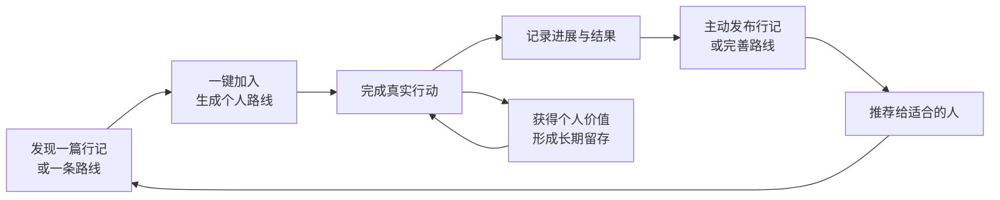
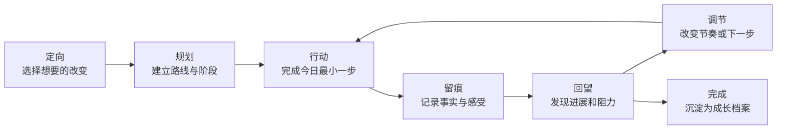
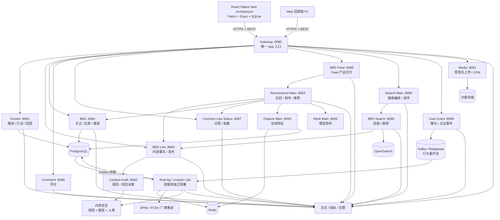
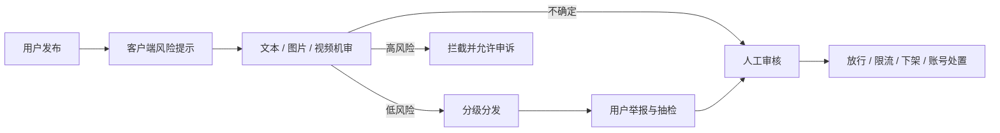
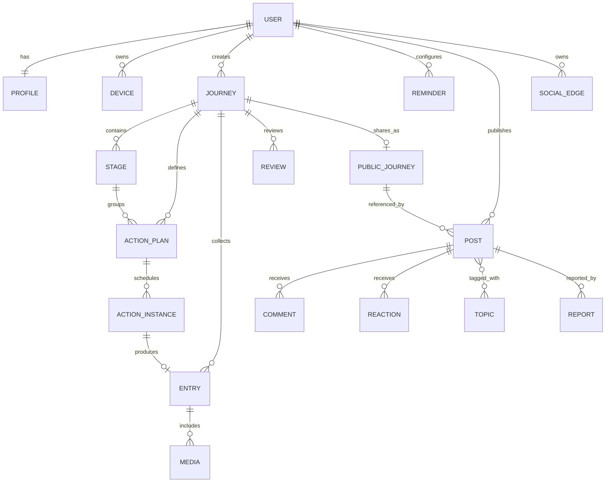

# 万卷行 Bookway

> 让每一种值得向往的生活，都有路可循。

万卷行是一款“行动型生活方式社区”。它把学习、旅行、健康、运动、休闲等看似分散的生活目标，组织成一条条可执行、可记录、可回望、可分享的“成长路线”。用户不只在这里看见理想生活，还能一键走上别人验证过的路线，并用自己的真实行动帮助下一位用户。

本文是万卷行的产品与研发全景规划，可同时作为产品立项说明、交互设计基线、MVP 范围和技术实施总纲。

| 项目 | 内容 |
| --- | --- |
| 中文名 | 万卷行 |
| 英文名 | Bookway |
| 产品形态 | iOS / Android 移动应用，后续扩展 Web、创作者与开放平台 |
| 当前阶段 | 生产基础设施接入与容量验证版本 |
| 文档版本 | v0.5 |
| 更新日期 | 2026-08-11 |

## 目录

- [1. 产品定义](#1-产品定义)
- [2. 用户与场景](#2-用户与场景)
- [3. 产品模型](#3-产品模型)
- [4. 信息架构](#4-信息架构)
- [5. 关键体验设计](#5-关键体验设计)
- [6. 领域能力设计](#6-领域能力设计)
- [7. 视觉与内容设计](#7-视觉与内容设计)
- [8. MVP 范围](#8-mvp-范围)
- [9. 数据与指标](#9-数据与指标)
- [10. 技术方案](#10-技术方案)
- [11. 数据模型与接口](#11-数据模型与接口)
- [12. 隐私、安全与合规](#12-隐私安全与合规)
- [13. 商业化](#13-商业化)
- [14. 研发路线图](#14-研发路线图)
- [15. 测试与发布标准](#15-测试与发布标准)
- [16. 风险与应对](#16-风险与应对)
- [17. 待验证问题](#17-待验证问题)

## 1. 产品定义

### 1.1 一句话定位

万卷行是一个以“成长路线”为核心的行动型生活方式社区，连接内容发现、计划执行、真实记录和经验分享，让“看见一种可能”可以直接转化为“开始一条路线”。

### 1.2 用户问题

现有工具往往只解决成长过程的一部分：

- 内容平台让用户知道很多，却不负责把知识变成行动。
- 待办工具擅长完成任务，却很难回答“我为什么做”和“我成长了什么”。
- 习惯工具强调连续打卡，容易让中断变成挫败，也难以承载旅行、课程等阶段性目标。
- 运动、健康、旅行应用各自形成数据孤岛，用户看不到完整的生活轨迹。
- 相册和笔记保留了经历，却缺少目标、行动和复盘之间的关联。

万卷行解决的是：**如何把值得向往的生活方式，从可消费的内容转化为可执行、可验证、可传递的路线。**

### 1.3 产品价值

1. **看清方向**：将模糊愿望变成有周期、有阶段、有完成标准的路线。
2. **降低行动门槛**：每天只展示此刻值得做的少量行动。
3. **留下成长证据**：用文字、照片、时长、数量和地点记录真实进展。
4. **允许灵活调整**：通过周回望识别节奏，而不是因一次中断否定全部努力。
5. **连接完整生活**：在一个系统中看到学习、身体、见闻与休息如何共同构成个人成长。
6. **让经验可传递**：把个人实践沉淀为别人可以直接加入、调整和验证的路线。

### 1.4 差异化定位

| 对比类型 | 它们的核心 | 万卷行的不同 |
| --- | --- | --- |
| 内容社区 | 发现与消费内容 | 内容可以一键变成路线，价值在行动后继续发生 |
| 待办清单 | 完成离散任务 | 行动始终归属于长期路线和阶段 |
| 习惯打卡 | 连续性与次数 | 同时支持习惯、项目、旅程和一次性挑战 |
| 日记笔记 | 自由记录 | 记录可关联行动，并自动进入周期回望 |
| 垂直健康/运动应用 | 单领域专业数据 | 汇总多个生活领域，但不替代专业诊疗或训练工具 |

### 1.5 产品边界

即使以亿级社区为长期目标，首个版本仍明确不做：

- 不做只有消耗时长、无法导向行动的无限娱乐信息流。
- 不做课程、酒店、票务或运动装备交易平台。
- 不用等级、排行榜或强制连续打卡制造焦虑。
- 不提供医学诊断、治疗建议或高风险运动处方。
- 不让 AI 自动替用户设定人生目标或直接修改计划。
- 不追求覆盖专业健身、财务、医疗等垂直工具的全部能力。

### 1.6 产品原则

1. **行动优先于收藏**：每个内容入口最终都应能落到路线或行动。
2. **持续优先于连续**：允许暂停、跳过和降级目标，不惩罚合理中断。
3. **证据优先于分数**：优先展示做过什么、学到什么，而不是虚构的成长分。
4. **反思优先于评价**：回望帮助用户调整，不给生活贴“失败”标签。
5. **克制优先于打扰**：通知由用户主动设置，默认低频且可解释。
6. **隐私默认开启**：所有路线和记录默认仅自己可见。
7. **一个内核，多种生活**：通用成长引擎承载多个领域，领域模板只增加必要的专属字段和体验。
8. **消费必须通向行动**：推荐系统同时优化“看见”和“做到”，不把停留时长作为唯一目标。
9. **公开必须出于主动**：记录默认私密，发布是用户明确选择的独立动作。

### 1.7 规模化愿景

长期目标不是做一个“小而美的自律工具”，而是成为全球有影响力的行动型生活方式社区。抖音和小红书级别意味着数亿月活、千万级内容供给、多语言和多地区运营；这不是靠增加功能实现的，而要同时建立四种网络效应：

1. **内容网络**：行动持续产生真实、有上下文的内容，内容越丰富，发现价值越高。
2. **路线网络**：一条路线被更多人采用、调整和完成后，适用条件与完成概率更清晰。
3. **关系网络**：用户围绕相似目标、地点和人生阶段建立关注与同行关系。
4. **数据网络**：在获得授权并完成匿名聚合后，系统更懂什么建议对什么人、在什么情境下有效。

产品规模的前提是用户价值和社会责任成立。**亿级 MAU 是长期结果，不是早期团队用注册量制造的目标。** 每个阶段只有在留存、内容供给、行动转化和安全指标同时达标后，才进入下一阶段。

### 1.8 双层产品结构

| 层级 | 用户价值 | 核心能力 | 成功结果 |
| --- | --- | --- | --- |
| 私人成长空间 | 管理自己的方向、行动和记录 | 路线、今日、留痕、回望 | 即使没有其他用户也持续有用 |
| 公共成长社区 | 发现可信经验并找到同行者 | 发现、搜索、发布、关注、互动、路线复用 | 每位行动者都可能成为供给者 |

两层通过隐私边界连接：私人记录不会自动公开；用户可以从某次记录中主动发布“行记”，也可以将完成后的路线整理为公共模板。社区内容被收藏后不是停在收藏夹，而是可以直接创建为个人路线。

### 1.9 核心增长飞轮



这个飞轮是万卷行区别于传统内容平台的核心：**内容不是终点，而是行动入口；行动不是私有死数据，而是可选择分享的新内容供给。**

### 1.10 社区内容原子

| 内容类型 | 用途 | 关键结构化信息 | 主要转化动作 |
| --- | --- | --- | --- |
| 行记 | 分享一次真实行动和收获 | 所属路线、行动、时间、可选地点 | 加入同款行动 / 查看路线 |
| 路线 | 分享一套可执行方法 | 适用人群、周期、阶段、行动、完成标准 | 一键加入路线 |
| 阶段成果 | 展示一段时间的变化 | 周期、投入、结果、调整过程 | 收藏 / 参考调整 |
| 提问与回答 | 解决执行中的具体阻碍 | 领域、阶段、问题状态 | 回答 / 关联路线 |

首发以图文为主，视频在内容供给和审核能力成熟后加入。所有来自真实路线的公开内容可显示“来自路线”，但不使用带有监控意味的“官方认证完成”。

### 1.11 可积累的产品资产

- **成长图谱**：人、领域、路线、行动、内容、地点与阶段之间的关系。
- **路线知识库**：版本、采用、完成、调整和适用条件形成的结构化经验。
- **意图信号**：搜索、收藏、加入路线和实际完成，比点赞更能表达长期兴趣。
- **创作者信誉**：依据路线透明度、长期帮助效果和社区反馈建立，而不是只看粉丝数。
- **品牌信任**：默认私密、克制推荐和反焦虑设计，在个人成长领域形成长期心智。

### 1.12 做到大规模必须成立的假设

| 战略假设 | 为什么关键 | 早期验证方式 |
| --- | --- | --- |
| 看内容能转化为真实行动 | 决定万卷行是否区别于普通内容社区 | 内容查看 → 加入路线 → 7 日行动漏斗 |
| 行动能低成本产生优质内容 | 决定 UGC 供给能否随用户增长 | 有效成长用户中的周发布率与内容合规率 |
| 社区能提高而非伤害个人留存 | 决定双层产品是否相互增强 | 社区加入路线用户与纯工具用户的同 cohort 留存对比 |
| 路线复用数据能改善匹配 | 决定成长图谱是否形成长期壁垒 | 推荐路线的采用、调整、完成反馈随样本增长是否改善 |
| 一个切口能自然扩展到相邻领域 | 决定“个人成长”是否是平台而非功能集合 | 学习用户对运动/休闲路线的自然跨领域采用率 |
| 安全和信任能跟上内容增长 | 决定社区能否持续扩大 | 举报率、处置 SLA、误伤申诉与私人数据事件 |

前四项若在多轮产品迭代后仍不成立，就不能用投放规模掩盖；应重新审视产品定位或增长模型。

## 2. 用户与场景

### 2.1 核心用户

首发聚焦 18-35 岁、有主动成长意愿但难以长期维持节奏的学生和城市知识工作者。相比追求极限效率的人，他们更关心生活是否在向理想状态靠近。

| 用户类型 | 典型状态 | 核心诉求 | 主要阻力 |
| --- | --- | --- | --- |
| 多目标行动者 | 同时学语言、运动、读书 | 将多项目放进一个稳定节奏 | 工具分散、计划过载 |
| 阶段探索者 | 准备旅行、转岗或学习新技能 | 把陌生目标拆成可走的路径 | 不知道下一步做什么 |
| 节奏修复者 | 忙碌、倦怠后想重建生活 | 从低压力行动恢复掌控感 | 害怕打卡中断和自责 |
| 经历记录者 | 有运动、旅行、阅读记录习惯 | 看到长期积累和人生轨迹 | 记录零散，缺少关联 |
| 路线发现者 | 想改变但尚未形成明确目标 | 看到可信案例并低成本开始 | 内容很多，能照着做的很少 |
| 成长创作者 | 持续实践且愿意分享方法 | 让经验帮助他人并建立影响力 | 普通内容难表达完整过程和效果 |

### 2.2 核心 JTBD

- 当我有一个想实现但比较模糊的目标时，我希望快速得到一条现实可行的路线，以便知道今天从哪里开始。
- 当生活中有多个目标并行时，我希望每天只看到少量关键行动，以便不过度计划也不丢失方向。
- 当我完成学习、运动或旅行经历后，我希望几秒内留下记录，以便未来能看见自己真实走过的路。
- 当计划被打断时，我希望系统帮助我调整强度和节奏，以便继续前进而不是彻底放弃。
- 当一周或一段旅程结束时，我希望看到进展、感受与变化，以便决定下一阶段做什么。
- 当我看到别人分享的成长经历时，我希望直接获得适合自己的可执行版本，而不是只收藏一篇内容。
- 当我的实践确实有效时，我希望低成本整理成别人可以使用的路线，并知道它真实帮助了多少人。

### 2.3 典型场景

1. **早晨定向**：用户打开“今日”，确认今天安排的一次阅读和一次散步。
2. **行动中**：从行动卡片启动 25 分钟专注或运动计时。
3. **完成留痕**：结束后记录时长、感受，附一张照片或一句心得。
4. **旅行在途**：到达地点后快速记录位置、照片和见闻，归入旅行路线。
5. **周末回望**：系统汇总完成情况、精力和高频阻碍，用户调整下周节奏。
6. **中断恢复**：用户暂停数日后返回，系统提供“从最小行动继续”，而不是提示连续记录失败。
7. **发现路线**：用户搜索“零基础跑步”，读完真实阶段成果后一键生成自己的入门路线。
8. **行动成文**：用户完成一次城市徒步，将照片和路线记录整理为行记并主动发布。
9. **创作者迭代**：路线作者看到多人在同一阶段调整计划，更新模板说明和轻量版本。

## 3. 产品模型

### 3.1 核心概念

| 产品概念 | 定义 | 示例 |
| --- | --- | --- |
| 领域 Domain | 成长发生的生活方向 | 学习、旅行、健康、运动、休闲 |
| 路线 Journey | 有明确意图和周期的一段成长计划 | 12 周读完中国通史、完成首次 10km |
| 阶段 Stage | 路线中的里程碑 | 基础训练、巩固提升、完成挑战 |
| 行动 Action | 可以被安排和完成的最小执行单元 | 阅读 30 分钟、慢跑 3km |
| 留痕 Entry | 行动后形成的事实或感受记录 | 30 分钟、3.2km、一张照片、一段心得 |
| 回望 Review | 对一段周期的总结和路线调整 | 周回望、阶段回望、路线总结 |

### 3.2 核心闭环



### 3.3 路线类型

路线创建时选择类型，让计划行为符合目标本身：

| 类型 | 特点 | 完成方式 | 示例 |
| --- | --- | --- | --- |
| 习惯型 | 重复发生，无固定总量 | 达到周期内目标频率 | 每周冥想 4 次 |
| 项目型 | 有阶段、截止时间和交付物 | 完成全部必要里程碑 | 8 周完成一门课程 |
| 数量型 | 围绕可累计指标推进 | 达成总量目标 | 阅读 12 本书、骑行 500km |
| 旅程型 | 围绕时间、地点和经历展开 | 完成行前、在途、归来阶段 | 徒步武功山 |
| 挑战型 | 短周期、边界明确 | 在限定时间满足条件 | 7 天早睡挑战 |

### 3.4 路线状态

`草稿 → 进行中 ↔ 已暂停 → 已完成 → 已归档`

- 草稿可以自由编辑，不进入今日安排。
- 暂停必须允许选择原因和预计恢复时间，但原因可跳过。
- 已完成路线保留全部记录并生成总结。
- 归档只隐藏，不删除数据；删除需要二次确认和恢复期。

### 3.5 核心规则

- 同时进行中的路线建议不超过 3 条，但 MVP 不做硬限制。
- 每条路线必须有一个可被用户理解的完成标准。
- 每个行动必须属于一条路线，可选关联一个阶段。
- 行动支持一次性和重复计划，重复规则使用结构化日历规则存储。
- 完成行动时可不写心得；系统只要求最小必要信息。
- 跳过行动不等于失败，可标记“没时间、状态不佳、计划不合理、已用其他方式完成”。
- 路线调整保留版本历史，回望时能解释计划为什么变化。

## 4. 信息架构

### 4.1 一级导航

底部使用 5 个固定入口，兼顾个人行动和公共发现，中央为创作按钮：

| 导航 | 图标建议 | 作用 |
| --- | --- | --- |
| 今日 | `House` | 今日行动、精力状态、最近进展 |
| 发现 | `Compass` | 推荐、关注、搜索、主题与附近路线 |
| 创作 | `Plus` | 快速记录，或将记录发布为行记 |
| 路线 | `Route` | 管理进行中、草稿、已完成路线 |
| 我的 | `User` | 个人主页、回望、收藏、创作中心与设置 |

### 4.2 页面树

```text
万卷行
├── 首次体验
│   ├── 价值选择
│   ├── 领域与节奏设置
│   └── 创建第一条路线
├── 今日
│   ├── 今日行动
│   ├── 行动详情 / 计时
│   ├── 快速完成
│   └── 今日小结
├── 发现
│   ├── 推荐 / 关注
│   ├── 搜索 / 主题 / 地点
│   ├── 行记详情
│   ├── 公共路线详情
│   └── 作者主页
├── 路线
│   ├── 路线列表
│   ├── 创建路线
│   ├── 路线详情
│   ├── 阶段与行动管理
│   └── 调整 / 暂停 / 完成路线
├── 创作
│   ├── 关联行动
│   ├── 文字 / 数值 / 照片 / 地点
│   ├── 心情与体感
│   ├── 发布行记
│   └── 发布路线
└── 我的
    ├── 个人主页 / 关注关系
    ├── 收藏 / 加入的路线
    ├── 创作中心
    ├── 周回望 / 阶段回望
    ├── 成长时间轴 / 路线总结
    ├── 成长档案
    ├── 数据统计
    ├── 通知与提醒
    ├── 数据导入导出
    └── 隐私、账号与外观
```

### 4.3 今日页信息优先级

“今日”不是数据看板，而是行动界面。首屏按以下顺序组织：

1. 日期、问候和精力快速状态。
2. 今日最重要行动，最多突出 3 项。
3. 其他可选行动与稍后安排。
4. 最近一次记录或路线进度，提供连续感。
5. 当日结束后出现轻量小结入口。

不在首页首屏放总积分、排行榜、信息流或大段教学说明。

### 4.4 发现页结构

发现页采用“关注 / 推荐”顶部分段切换，搜索始终可达：

- **关注**：按时间与重要关系信号组织，保证用户能稳定看到主动关注的人。
- **推荐**：混合行记、路线和阶段成果，支持图文双列与沉浸式单列，但不自动播放有声视频。
- **搜索**：同时检索问题、路线、行记、用户、主题和地点，优先展示可执行结果。
- **主题页**：聚合同一目标或情境，如“下班后的 30 分钟”“第一次独自旅行”。
- **路线卡**：必须展示周期、投入、适用人群、采用人数和行动入口，而不只是封面标题。

推荐结果允许用户选择“不感兴趣”“不看该作者”“减少此类内容”，并解释内容出现的主要原因。

### 4.5 冷启动首页

- 无路线的新用户默认先看到根据 3-5 个兴趣生成的精选发现页，并持续展示“开始第一条路线”的明确入口。
- 已有今日行动的用户默认进入“今日”，避免内容消费挤占实际行动。
- 用户可在设置中固定默认首页；系统不频繁自动切换，以免导航失去可预期性。

## 5. 关键体验设计

### 5.1 首次体验

目标是在 3 分钟内创建或加入第一条路线，并看到第一个可执行行动。

1. 用户从“想改善什么”中选择 3-5 个兴趣，立即改善冷启动推荐。
2. 选择当前最符合自己的状态：刚开始、在坚持、重新开始。
3. 设置每周愿意投入的天数和单次时长，不要求精确日程。
4. 系统推荐 3 个低门槛模板，也允许从空白路线开始。
5. 用户确认路线名称、周期、首个阶段和下一步行动。
6. 先进入应用再引导注册；需要云同步时再绑定手机号、邮箱或系统账号。

原则：不在首次启动索取通讯录、位置、健康等非必要权限；权限在对应功能首次使用时解释并申请。

浏览精选公共内容和本地创建路线可以匿名完成；关注、评论或发布等公共行为必须先绑定账号并接受社区规范。

### 5.2 创建路线

采用分步表单，每一步只解决一个问题：

1. **方向**：我想实现什么，为什么现在想做。
2. **类型**：习惯、项目、数量、旅程或挑战。
3. **完成标准**：什么事实代表这条路线已经完成。
4. **节奏**：开始与结束时间、每周频率、偏好时段。
5. **阶段**：使用模板生成或自己拆分。
6. **下一步**：确保创建结束时已有一个近期行动。

系统对过载计划给出中性提示，例如：“当前安排约每周 8 小时，高于你选择的 4 小时，可调整后开始。”用户可以继续，不强制拦截。

### 5.3 今日行动

行动卡片只显示完成决策所需的信息：行动名、所属路线、预计时长/数量、安排时间和开始按钮。

- 左滑跳过或改期，右滑快速完成；两种手势均提供撤销。
- 点击行动进入详情，可启动计时、查看备注或编辑目标量。
- 完成后先给予即时状态反馈，再展开可选留痕字段。
- 首页排序综合固定时间、优先级、所需精力和用户手动排序。
- 精力较低时可切换“轻量一天”，展示预先设置的最小版本行动。

### 5.4 快速记录

中央 `+` 打开底部操作面板：

- 完成一个已安排的行动。
- 记录一个计划外行动并选择归属路线。
- 添加一条自由见闻，稍后再整理。

最短路径不超过两步：选择行动 → 确认完成。文字、照片、位置、时长、数量、感受均为可选增强信息。

### 5.5 路线详情

页面由连续的内容区组成，不使用层层嵌套卡片：

- 顶部：路线名称、当前阶段、状态和关键完成标准。
- 进展：阶段时间线及可解释的实际进展，不显示虚假精确度。
- 接下来：近期行动和添加行动入口。
- 足迹：按时间排列的照片、数据和文字记录。
- 管理菜单：调整计划、暂停、完成、归档和删除。

### 5.6 周回望

每周回望控制在 3-5 分钟：

1. **事实**：本周计划、完成、改期和跳过了什么。
2. **感受**：精力与满意度，使用 5 级量表并允许跳过。
3. **发现**：系统基于事实给出简短摘要，不做人格判断。
4. **调整**：保持、降低、提高或暂停下周节奏。
5. **聚焦**：为下周选择一件最重要的事。

摘要示例：“你在上午完成学习行动的概率更高；两次晚间行动均被改期。下周是否将学习安排到上午？”

### 5.7 中断与恢复

- 连续 3 次跳过后，不发送催促式提醒，在下次打开时询问是否调整计划。
- 超过 7 天未行动，首页提供“继续原计划”“降低强度”“暂停路线”三个清晰选择。
- 恢复时默认安排最小行动，不要求补做历史任务。
- 不展示“中断 X 天”之类带羞耻感的文案。

### 5.8 完整状态设计

每个关键页面必须同时设计以下状态：

- **空状态**：提供一个明确下一步，而不是功能介绍。
- **加载状态**：使用稳定尺寸骨架，避免内容跳动。
- **离线状态**：允许记录并标记待同步，核心数据可本地访问。
- **错误状态**：解释影响范围，保留用户输入，提供重试。
- **权限拒绝**：核心功能仍可用，并给出替代输入方式。
- **完成状态**：提供撤销和下一步，不使用全屏强打断庆祝动画。

### 5.9 从发现到行动

内容详情页的首要差异化操作不是“点赞”，而是“加入路线”或“尝试这个行动”：

1. 用户从推荐、搜索、外部分享或作者主页进入行记。
2. 页面展示真实结果，同时明确路线周期、投入和适用条件。
3. 点击“走这条路线”后先预览将创建的阶段和行动。
4. 用户选择开始日期、每周投入和轻量版本，系统生成私人副本。
5. 原作者后续更新不强制覆盖副本；用户可主动查看和合并更新。
6. 首次行动完成后，再询问是否关注作者或加入同路主题。

这一流程的核心指标是“内容到有效行动转化率”，不是内容点击率。

### 5.10 发布行记

- 完成行动后提供“仅保存”与“发布行记”两个同级选择，默认仅保存。
- 发布编辑器自动带入可公开的路线名称和行动类型，不自动带入私人心得、精确时间或位置。
- 图文首发支持 1-9 张图片、标题、正文、主题和路线关联；视频能力在 P1 加入。
- 发布前提供隐私预览，精确地点默认降为城市或关闭。
- 发布后可以修改可见范围、关闭评论或删除；删除公共内容不删除私人原始记录。
- 外部分享生成带深链的图片或网页，接收者可预览路线并在安装后继续加入流程。

### 5.11 公共路线与版本

- 公共路线是模板，用户加入后生成独立的私人实例。
- 作者可以发布新版本，必须填写变更说明；旧版本仍可查看。
- 采用人数、7 日启动率和阶段完成反馈可用于路线质量判断，但小样本不显示误导性百分比。
- 用户完成路线后可提交“适合谁、哪里最难、如何调整”等结构化反馈。
- 路线作者只能看到匿名聚合数据，不能看到采用者的私人行动和记录。

### 5.12 社交与社区治理体验

- 首发支持关注、点赞、收藏、评论、举报和拉黑，不支持陌生人私信。
- 青少年模式、评论权限、内容可见范围和互动通知必须易于找到。
- 举报后立即隐藏对当前用户的相关内容，并提供处理进度。
- 创作者工作台展示阅读、收藏、路线采用、实际启动和匿名完成反馈；弱化单一粉丝数。
- 不展示全站个人成长排行榜，不允许以健康焦虑、极端节食或危险挑战换取流量。

## 6. 领域能力设计

领域模板基于同一个成长引擎，仅扩展记录字段、推荐阶段和统计方式。

| 领域 | 推荐模板 | 专属记录 | 示例阶段 |
| --- | --- | --- | --- |
| 学习 | 阅读计划、课程学习、语言训练、技能项目 | 页数、章节、专注时长、知识卡片 | 入门、练习、输出、检验 |
| 旅行 | 行前准备、城市探索、长线旅行、户外徒步 | 地点、照片、里程、见闻、可选支出 | 计划、准备、在途、归来 |
| 健康 | 作息调整、饮水、情绪觉察、恢复计划 | 睡眠、饮水、精力、主观感受 | 观察、微调、稳定 |
| 运动 | 跑步、力量、骑行、游泳、拉伸 | 时长、距离、组数、重量、主观强度 | 适应、积累、提升、恢复 |
| 休闲 | 冥想、手作、观影、音乐、无屏时间 | 时长、作品、感受、照片 | 尝试、沉浸、分享 |

### 6.1 领域边界

- 健康数据只用于自我记录和趋势观察，不输出诊断结论。
- 运动模板默认保守强度；高风险动作不由通用 AI 自动生成。
- 旅行位置始终可关闭，可只记录城市级信息。
- 休闲路线不默认设置连续天数，避免把放松变成新的绩效任务。
- 学习统计关注投入与输出，不把阅读页数等同于理解程度。

### 6.2 模板结构

每个模板包含：

- 适用人群与预期成果。
- 建议周期、阶段和完成标准。
- 每周频率及单次行动的轻量/标准版本。
- 可编辑的示例行动。
- 风险提示和不适用条件。

模板只是创建起点。使用模板生成路线后，用户拥有完整编辑权，模板更新不会覆盖已有路线。

## 7. 视觉与内容设计

### 7.1 品牌方向

“万卷”代表知识和丰富经历，“行”同时代表行走与行动。品牌气质应当沉静、开阔、可信，不做古风装饰堆砌，也不使用强竞技化视觉。

- 标志概念：一本展开的书与一条向前延伸的路形成同一轮廓。
- 核心意象：路径、页码、足迹、地理等高线、时间刻度。
- 摄影方向：真实的学习桌面、城市与自然路径、运动现场和个人作品，避免纯氛围素材。
- 动效方向：路线推进、页面翻动和记录落点，时长 150-250ms，支持系统“减少动态效果”。

### 7.2 色彩系统

| Token | 建议色值 | 用途 |
| --- | --- | --- |
| `brand-primary` | `#1E5C4A` | 主操作、进行中路线 |
| `brand-secondary` | `#C94B3C` | 关键强调、重要节点 |
| `accent-gold` | `#D7A43B` | 里程碑、温和提示 |
| `surface` | `#F7F7F4` | 主背景 |
| `surface-raised` | `#FFFFFF` | 浮层和独立卡片 |
| `text-primary` | `#202522` | 主文字 |
| `text-secondary` | `#66706A` | 辅助信息 |
| `border` | `#DDE2DE` | 分隔和边框 |
| `danger` | `#B42318` | 删除与错误 |

暗色模式采用独立语义色板，不直接反转颜色。所有正文与交互控件须满足 WCAG AA 对比度。

### 7.3 排版与布局

- 中文优先使用系统字体；数字统计使用等宽数字特性。
- 正文最小 16sp，辅助文字不低于 13sp，支持系统字号放大。
- 8pt 间距体系，常用间距为 8 / 12 / 16 / 24 / 32。
- 卡片圆角不超过 8px；页面分区优先使用留白和分隔线。
- 图标按钮保持至少 44×44pt 点击区域，并提供无障碍标签和工具提示。
- 固定格式的行动卡、计时器和统计图预留稳定尺寸，加载或更新时不引发布局位移。

### 7.4 组件清单

- 路线阶段时间线
- 今日行动卡
- 轻量/标准行动切换
- 进度条与数量环（仅在有真实分母时使用）
- 计时器与数值步进器
- 领域与颜色选择色板
- 情绪/精力五级选择器
- 照片、地点和文字记录编辑器
- 周回望趋势图
- 空状态、离线条、同步状态和撤销提示

工具类按钮使用 Lucide 图标或平台原生图标，熟悉操作优先只显示图标；破坏性操作和不熟悉命令使用“图标 + 文本”。

### 7.5 文案语气

文案应具体、平和、有行动指向。

| 场景 | 推荐 | 避免 |
| --- | --- | --- |
| 未完成 | 今天未安排这项行动 | 你又失败了 |
| 中断恢复 | 从一个小行动继续 | 连续记录已中断 |
| 跳过 | 这次为什么不做？ | 放弃打卡 |
| 进度 | 你已完成 4 次练习 | 你的自律值提升了 |
| 调整 | 当前节奏是否还适合？ | 坚持就是胜利 |

## 8. MVP 范围

### 8.1 MVP 成功定义

MVP 必须同时验证个人价值和网络价值：

- **个人闭环成立**：新用户能在 3 分钟内创建或加入第一条路线，首周至少完成 2 个行动和 1 次回望。
- **社区闭环成立**：用户能从一篇行记加入路线，并在 7 天内完成至少一个行动；部分行动者愿意主动发布新的行记。
- **长期价值出现**：经过 4 周，用户仍在推进、调整或创建路线，而不是只消费内容。

### 8.2 P0：首发必须具备

- 匿名本地使用，手机号/邮箱/Apple 登录后云同步。
- 首次领域、节奏选择与第一条路线创建。
- 5 类路线与学习、运动、休闲的基础模板。
- 路线、阶段、一次性/重复行动的创建和编辑。
- 今日行动列表、排序、完成、跳过、改期和撤销。
- 文字、照片、时长、数量、感受记录。
- 行动计时器，退到后台后仍能正确计算。
- 周回望、路线调整、暂停、恢复、完成和归档。
- 本地通知、时区处理和勿扰设置。
- 核心数据离线可用、联网后增量同步。
- 数据导出、账号注销、隐私设置和权限管理。
- 基础埋点、崩溃监控、服务端审计日志。
- 精选 / 关注双流、主题页、基础搜索和公共内容详情。
- 图文行记发布、公共路线发布与版本管理。
- 从行记或公共路线一键生成私人路线副本。
- 个人公共主页、关注、点赞、收藏、评论、分享和深链。
- 发布隐私预览、评论开关、举报、拉黑和运营审核后台。
- 基础推荐召回与排序，支持“不感兴趣”和推荐原因反馈。

### 8.3 P1：验证核心后增加

- 旅行地点、地图时间轴和旅行模板。
- 健康趋势记录，接入 Apple Health / Health Connect 的只读数据。
- 更丰富的运动指标和个人最佳记录。
- 桌面小组件、锁屏快捷记录。
- 日历视图与系统日历只读/双向同步。
- 短视频行记、视频处理与字幕。
- 创作者工作台、路线采用漏斗与匿名完成反馈。
- 更完整的搜索、附近内容和热点主题。
- 小组同行、共同路线与受控站内消息。
- AI 辅助拆解路线、生成周摘要和发现节奏。
- Web 端长周期回顾与数据整理。

### 8.4 P2：规模化阶段考虑

- 多语言、多地区内容与跨区域运营。
- 创作者分成、付费路线和品牌合作平台。
- 创作者模板与专业教练计划。
- 城市探索路线和文化内容合作。
- 穿戴设备实时数据接入。
- 公开成长档案与精细可见范围。
- 面向第三方应用的路线与记录开放平台。

### 8.5 明确延后

- 陌生人私信、全站排行榜和直播。
- 电商、课程交易、票务和酒店预订。
- 通用笔记编辑器和知识库。
- 医疗建议、饮食处方和自动训练处方。
- 复杂积分商城、虚拟货币和随机奖励。

## 9. 数据与指标

### 9.1 北极星指标

**每周有效成长用户（Weekly Effective Growth Users, WEGU）**：一名用户在一周内至少完成一个与路线关联的真实行动，并完成记录、回望或发布中的任一深度行为，即记为有效成长用户。

该指标同时覆盖私人行动者和社区创作者，关注用户是否真实推进自己选择的方向，避免用打开次数、视频播放量或使用时长替代用户价值。原“每周有效推进路线数（WPJ）”保留为重要业务指标。

### 9.2 指标体系

| 层级 | 指标 | 定义 |
| --- | --- | --- |
| 获得 | 首条路线获得率 | 首次启动后 24 小时内创建或加入路线的用户占比 |
| 激活 | 首周有效激活率 | 7 天内完成 ≥2 个行动且完成一次回望 |
| 发现 | 内容到路线转化率 | 查看内容后 24 小时内加入关联路线的用户占比 |
| 兑现 | 加入后 7 日行动率 | 从社区加入路线后 7 天内完成行动的用户占比 |
| 行动 | 计划履约率 | 完成行动数 / 到期且未取消行动数 |
| 留痕 | 行动记录率 | 带至少一种记录的完成行动占比 |
| 供给 | 有效创作者率 | 每周发布至少一条合规且产生有效互动内容的用户占比 |
| 复用 | 路线复用系数 | 每条公开路线带来的有效私人路线数 |
| 调节 | 路线调整率 | 回望后合理调整节奏的活跃路线占比 |
| 留存 | W4 路线留存 | 第 4 周仍推进或主动调整路线的用户占比 |
| 质量 | 崩溃无感会话率 | 无崩溃会话 / 总会话 |

### 9.3 护栏指标

- 通知关闭率和单条通知投诉率。
- 连续跳过后卸载率。
- 用户主动删除记录/账号的失败率。
- 同步冲突率、重复记录率和数据恢复成功率。
- AI 建议拒绝率、健康安全反馈和内容举报率。
- 低质内容率、举报处理时长、误伤申诉率和未成年人风险事件。
- 推荐集中度、创作者曝光基尼系数与新作者冷启动成功率。
- 内容消费时长 / 行动时长比例，防止社区反过来吞噬用户行动。
- 平均每日使用时长只作为体验诊断，不以“越长越好”为目标。

### 9.4 核心事件

事件命名采用 `object_action`，属性不上传自由文本、精确位置或健康原始值。

```text
onboarding_started
onboarding_completed
journey_created
journey_started
journey_adjusted
journey_paused
journey_completed
action_started
action_completed
action_rescheduled
action_skipped
entry_created
feed_viewed
search_submitted
content_viewed
content_published
content_reacted
content_saved
content_reported
creator_followed
public_journey_viewed
public_journey_joined
share_link_opened
review_started
review_completed
reminder_opened
sync_failed
```

每个事件至少包含 `event_version`、匿名用户标识、客户端时间、时区、平台、应用版本和来源页面。

## 10. 技术方案

### 10.1 技术决策

客户端确定采用 React Native 新架构与 Expo，后端确定采用 Rust + Axum。首版后端直接按业务服务拆分，使用模块化微服务边界；每个服务内部通过 `api`、`domain`、`service`、`datasource` 和 `registry` 组织依赖，客户端只访问 Gateway。

当前仓库已完成本阶段的生产基础设施基线：十五个 Axum 服务，SQLx/PostgreSQL Repository，Redis 限流与特征缓存，Transactional Outbox + Kafka Relay，OpenSearch 索引与检索降级，S3/MinIO 预签名直传与 CDN，内容审核，在线特征与排序服务，Gateway JWT、下游服务令牌，以及 Prometheus 指标、readiness 和 SLO。默认内存模式仅用于无依赖开发。本地真实依赖联调已覆盖数据库迁移、事件投递、对象上传、搜索/推荐降级、审核状态机和服务间鉴权。该结论不等同于已经拥有抖音或小红书的实际容量；在完成持续压测、容量模型、备份恢复与多区域故障演练前，不得以“亿级生产可用”作为发布结论。

| 层级 | 推荐方案 | 说明 |
| --- | --- | --- |
| 移动端 | React Native 当前稳定版 + TypeScript strict + Expo | 一套代码覆盖 iOS/Android，保持 Expo SDK 与 RN 版本配套 |
| RN 运行架构 | New Architecture：Fabric + TurboModules / JSI + Hermes | 新增原生依赖必须通过新架构兼容性检查 |
| 原生构建 | Expo Development Build + EAS Build / Submit | 本地开发不依赖 Expo Go；需要时通过 Prebuild 管理原生工程 |
| 路由 | Expo Router | 文件路由、深链和 Universal Links / App Links |
| 服务端状态 | TanStack Query | 缓存、重试、失效与同步状态 |
| 本地状态 | Zustand | 仅保存界面和临时交互状态 |
| 表单/校验 | React Hook Form + Zod | 客户端表单与本地输入校验 |
| 本地数据库 | Expo SQLite | 离线读取、写入队列和增量同步 |
| API | Rust + Axum + Tokio + Tower + Serde | 异步 HTTP、统一中间件、结构化序列化与错误处理 |
| API 契约 | utoipa / utoipa-axum + OpenAPI + Orval | Rust 路由生成规范，再生成 TypeScript SDK 与 Query hooks |
| 服务端校验 | validator + 领域值对象 | 传输层校验格式，领域层校验业务不变量 |
| 数据库 | PostgreSQL + SQLx | 显式 SQL、事务、编译期查询检查和迁移 |
| 缓存 | Redis | 热点缓存、限流、短期状态和分布式协调 |
| 异步任务 | PostgreSQL Transactional Outbox + Kafka/Redpanda + Rust Worker | 保证业务写入和事件投递一致，支持退避、死信和重放演进 |
| 对象存储 | S3 兼容存储 + CDN | 图片原图、缩略图和导出文件 |
| 搜索 | OpenSearch + PostgreSQL 事实源 | CJK 多字段检索、删除传播、重建和事实源降级 |
| 媒体处理 | Rust Worker + libvips，P1 引入 FFmpeg | 图片缩放、审核副本和视频转码 |
| 通知 | APNs / FCM，国内安卓厂商通道后续接入 | 本地提醒优先，服务端通知克制使用 |
| 监控 | tracing + Prometheus，后续接入 Sentry/OpenTelemetry | 服务端日志、指标、SLO；移动端崩溃和分布式追踪待补齐 |
| 工程管理 | `frontend/` npm 工程 + `backend/` Cargo workspace | 独立依赖、锁文件、构建和发布，仅通过版本化 HTTP 契约通信 |

客户端开启 `newArchEnabled`，使用 Hermes，并将 Fabric 真机回归作为发布门槛。任何只支持旧 Paper 架构的核心依赖不得进入主链路；确需自定义原生能力时优先采用 Expo Modules API，并同时验证 iOS、Android 和 EAS 构建。

Expo 配置显式保留新架构开关，避免升级和环境差异让关键配置变得隐式：

```json
{
  "expo": {
    "newArchEnabled": true,
    "jsEngine": "hermes"
  }
}
```

### 10.2 总体架构



### 10.3 服务端模块与微服务边界

首版服务自治方式拆分：

- `gateway`：8080，App 唯一入口，鉴权、聚合、限流、CORS 和对外版本化 REST。
- `growth`：8081，私人成长核心，包括路线、行动、今日清单、完成记录和回望。
- `bbs`：8082，只持有关注、拉黑、静音和社交图谱。
- `recommend-main`：8083，负责 Query Hydration、候选源、补全、过滤、意图评分、多样性选择和曝光副作用。
- `bbs-link`：8084，内容 Link 服务，持有内容事实、版本和发布状态。万卷行没有旧版迁移包袱，因此不沿用历史性的 `v2` 目录名。
- `bbs-search`：8085，负责内容、路线、用户、主题检索和联想。
- `comment`：8086，独立持有评论正文和父子关系。
- `commonlikestatus`：8087，独立持有点赞、收藏和批量互动状态。
- `bbs-feed`：8088，负责 Feed 请求规范化、产品策略和结果交付，再调用推荐主服务。
- `user-event`：8089，接收组件曝光、点击、播放、互动和搜索等批量事件。
- `search-main`：8090，负责查询规范化、搜索流水线编排、实验和降级；`bbs-search` 保持检索能力层。
- `media`：8091，S3/MinIO 上传控制面、媒体元数据和 CDN 地址。
- `content-audit`：8092，文本规则审核、风险决策与审核证据。
- `feature-main`：8093，Redis/PostgreSQL 特征读取与版本化默认特征。
- `rank-main`：8094，模型排序、实验桶与启发式降级。

每个服务都可独立构建、发布和扩容。服务间只依赖公开 DTO 和 HTTP，不访问其他服务的 `internal` 源码；服务内部的数据源可从内存替换为 SQLx、Redis 或对象存储，而不改变 handler 和领域服务。

推荐流水线的组件顺序固定为 `query hydrator → sources → hydrators → filters → scorers → selector → side effects`。内容召回并行，BBS 关系和互动状态分别补全，副作用失败不能阻断主推荐结果；后续可按 `x-algorithm` 引入关注、相似、热门和探索召回。

### 10.4 离线与同步

移动端采用本地优先模型：

1. 用户操作先写入 SQLite，并生成 UUIDv7 实体 ID 和全局唯一 `operation_id`。
2. 同步队列按依赖顺序提交，Axum 服务通过幂等键去重，并在同一 SQLx 事务内写业务数据与 Outbox。
3. 客户端使用游标拉取增量变更和软删除记录。
4. 简单字段使用“较新版本优先”；路线结构等复杂冲突保留双方版本并提示用户选择。
5. 媒体先保存本地引用，后台获得上传凭证后直传对象存储。
6. 所有记录同时保存 UTC 时间、原始时区和本地日期，避免跨时区旅行时统计错位。

### 10.5 AI 能力边界（P1）

AI 定位为“行伴”，只提供辅助建议：

- 根据用户输入生成可编辑的路线草稿。
- 将大目标拆成阶段和最小行动。
- 基于结构化数据起草周摘要并指出可验证的规律。
- 在计划过载或频繁跳过时给出调整选项。

所有生成内容必须在保存前由用户确认；不把私密正文用于模型训练；位置和健康数据默认不进入模型上下文；健康和高风险运动场景使用规则限制并展示安全提示。模型不可用时，模板和手动规划仍应完整可用。

### 10.6 推荐仓库结构

前后端放在同一个 Git 仓库中便于产品早期协作，但保持工程级解耦：

- `frontend/` 是独立 TypeScript 工程，安装、测试和构建不依赖 Rust workspace。
- `backend/` 是独立 Rust 工程，编译、迁移和部署不依赖 Node.js workspace。
- 禁止跨目录源码引用、共享领域包或共用锁文件；业务规则以服务端为权威。
- 后端 CI 生成并发布带版本和校验值的 OpenAPI artifact；前端固定契约版本，在自己的目录内通过 Orval 生成 SDK。
- 根目录只保留产品文档、基础设施和 CI 编排，不设置根级 pnpm 或 Cargo workspace。

```text
bookway/
├── frontend/
│   └── apps/mobile/              # RN New Architecture + Expo + TypeScript
│       ├── src/api/              # Gateway HTTP client
│       ├── src/analytics/        # 曝光去重与批量事件上报
│       ├── src/components/       # 通用业务组件
│       ├── src/screens/          # 今日、发现、路线、我的
│       ├── package.json
│       └── package-lock.json
├── backend/
│   ├── bookway/
│   │   ├── gateway/             # App 唯一入口 :8080
│   │   ├── growth/              # 路线与行动服务 :8081
│   │   ├── bbs/                 # BBS 社交图谱服务 :8082
│   │   ├── recommend-main/      # 推荐主服务 :8083
│   │   ├── bbs-link/            # 内容事实服务 :8084
│   │   ├── bbs-search/          # 搜索服务 :8085
│   │   ├── comment/             # 评论服务 :8086
│   │   ├── commonlikestatus/    # 互动状态服务 :8087
│   │   ├── bbs-feed/            # Feed 产品交付服务 :8088
│   │   ├── user-event/          # 用户行为接收服务 :8089
│   │   ├── search-main/         # 搜索主编排服务 :8090
│   │   ├── media/               # 媒体控制面 :8091
│   │   ├── content-audit/       # 内容审核 :8092
│   │   ├── feature-main/        # 特征平台 :8093
│   │   └── rank-main/           # 模型排序 :8094
│   │       └── src/internal/
│   │           ├── api/         # 与 domain/service 同级的契约模块，无 Cargo.toml
│   │           ├── conf/        # 环境变量与服务配置
│   │           ├── datasource/  # 数据库、缓存和 RPC/HTTP client
│   │           ├── domain/      # 业务规则与推荐流水线
│   │           ├── registry/    # 资源、客户端和服务装配
│   │           └── service/     # Axum handler、路由和错误映射
│   ├── cmd/db-migrate/          # 发布前执行 SQLx 迁移
│   ├── cmd/outbox-relay/        # Kafka Outbox Relay
│   ├── cmd/search-indexer/       # OpenSearch 索引创建与重建
│   ├── deploy/                  # 本地生产依赖与 Prometheus
│   ├── infra/data/              # SQLx/Redis 连接池与存储模式
│   ├── infra/event/             # Kafka producer、Outbox retry/dead-letter
│   ├── infra/runtime/           # tracing、JWT、服务 token、限流、指标和 readiness
│   ├── pkg/api/                 # 稳定跨服务 DTO 与错误信封
│   ├── Cargo.toml               # 独立 workspace
│   ├── Cargo.lock
│   └── rust-toolchain.toml
├── infrastructure/              # IaC、容器和部署配置
├── docs/                        # ADR、研究、接口与设计文档
├── .github/workflows/
│   ├── frontend.yml             # 前端独立 CI
│   ├── backend.yml              # 后端独立 CI
│   └── api-contract.yml         # 契约兼容与更新检查
├── README.md
└── LICENSE
```

### 10.7 工程质量基线

- 主分支保护；`frontend/**` 与 `backend/**` 使用独立 CI 和 CODEOWNERS，契约变更额外触发跨端兼容检查。
- 移动端执行 TypeScript strict、ESLint、单元/组件测试、`expo-doctor` 和 Development Build 冒烟测试。
- Rust 执行 `cargo fmt --check`、`cargo clippy -- -D warnings`、`cargo nextest run`、`cargo deny check` 和发布构建。
- 默认在 workspace lint 中禁止 `unsafe`；确需 FFI 的媒体适配层单独隔离、审查和测试。
- 数据库变更只通过 SQLx 可审查迁移，CI 使用离线元数据执行 `cargo sqlx prepare --check`；生产环境禁止启动时自动迁移。
- Rust 端 utoipa 生成的 OpenAPI 是接口契约来源；后端 CI 发布 artifact 并检查破坏性变更，前端通过独立契约更新 PR 固定新版本并重新生成 SDK，生成产物禁止手改。
- Axum 统一配置请求体上限、超时、并发限制、CORS、压缩、`request_id` 和敏感日志过滤。
- API 与 Worker 支持优雅停机；Outbox 任务使用数据库租约、指数退避、最大重试和可观测死信状态。
- 使用 feature flag 隔离未完成能力和渐进发布。
- 密钥只进入密钥管理服务，不写入仓库或客户端包。
- 每个关键领域决策记录 ADR，避免架构只存在于口头沟通中。

### 10.8 部署建议

- 面向中国大陆用户时，优先选择阿里云或腾讯云国内区域，并提前处理 ICP、隐私政策、SDK 合规清单和安卓渠道上架。
- 面向全球测试时，可先使用托管 PostgreSQL、S3 兼容存储和容器平台，但需验证中国大陆网络质量。
- Axum API 和 Worker 分别构建为最小化、非 root OCI 镜像；API 保持无状态并通过健康检查、优雅停机和滚动发布部署。
- SQLx 连接池设置明确上限、获取超时与慢查询观测；连接数预算按实例和 PostgreSQL 总容量统一分配。
- 测试、预发布、生产环境完全隔离；生产数据不得复制到开发环境。
- 数据库每日备份并定期演练恢复，对象存储启用版本控制和生命周期策略。

### 10.9 按规模演进的架构

不为想象中的亿级流量提前建设复杂系统，但所有核心实体从第一天使用稳定 ID、明确所有权、可重放事件和版本化契约，为演进保留路径。

| 阶段 | 参考规模 | 架构重点 | 进入下一阶段的触发条件 |
| --- | --- | --- | --- |
| 验证期 | 0-10 万 MAU | 十五个 Rust/Axum 服务和 Worker；PostgreSQL、Redis、对象存储/CDN、事件流和 OpenSearch | 单服务容量或发布节奏已成为可测量瓶颈 |
| 增长期 | 10 万-100 万 MAU | Gateway、BBS、内容、评论、互动、搜索、推荐独立扩容，引入审核服务、OpenSearch、事件流、数仓和读副本 | 推荐延迟、事件吞吐或数据团队协作需要新的服务边界 |
| 平台期 | 100 万-1000 万 MAU | 社交图谱、媒体处理、通知拆分；分库分表；多级缓存；实时特征 | 单地域容灾、热点内容或推荐吞吐接近容量上限 |
| 大规模期 | 1000 万-1 亿 MAU | 单元化架构、跨地域容灾、实时流处理、独立特征平台与实验平台 | 地域、法规、成本或故障域要求进一步隔离 |
| 全球化期 | 1 亿+ MAU | 多地区数据治理、区域化推荐和审核、多活核心链路、全球 CDN | 按实际市场和法规持续演进 |

每次拆分都必须由压测、成本、故障域或组织边界证明，不以“看起来像大厂架构”为理由。

### 10.10 推荐系统演进

推荐的业务目标是“合适的人看见后愿意行动”，采用多目标而非单一停留时长：

1. **召回**：关注关系、兴趣主题、相似路线、搜索意图、地点、协同过滤和编辑精选。
2. **粗排**：过滤无关、重复、低质、已拉黑和安全风险内容。
3. **精排**：联合预估有效阅读、收藏、加入路线、7 日行动、负反馈和长期留存。
4. **重排**：控制领域多样性、作者集中度、内容新鲜度、新作者探索和连续消费时长。
5. **反馈**：点赞是弱信号，收藏和加入是中信号，真实行动和路线完成是强信号。

冷启动阶段用兴趣选择、编辑精选和明确搜索意图，不需要机器学习；拥有足够高质量反馈后再引入特征平台和模型。健康、未成年人和敏感个人信息不得用于广告或不必要的推荐画像。

### 10.11 内容安全链路



审核策略覆盖违法违规、危险挑战、医疗误导、极端节食、骚扰、未成年人风险、侵权和商业垃圾。处置规则必须版本化、可审计、可申诉；安全团队和运营能力要先于大规模内容投放建设。

## 11. 数据模型与接口

### 11.1 核心实体关系



### 11.2 关键表

| 表 | 关键字段 |
| --- | --- |
| `users` | `id`, `auth_state`, `created_at`, `deleted_at` |
| `profiles` | `user_id`, `display_name`, `timezone`, `locale`, `week_starts_on` |
| `journeys` | `id`, `user_id`, `domain`, `type`, `title`, `intent`, `status`, `start_on`, `end_on`, `completion_rule`, `version` |
| `stages` | `id`, `journey_id`, `title`, `position`, `start_on`, `end_on`, `status` |
| `action_plans` | `id`, `journey_id`, `stage_id`, `title`, `metric_type`, `target_value`, `schedule_rule`, `light_version`, `active` |
| `action_instances` | `id`, `action_plan_id`, `scheduled_for`, `state`, `completed_at`, `skip_reason`, `version` |
| `entries` | `id`, `journey_id`, `action_instance_id`, `note`, `value`, `unit`, `mood`, `energy`, `occurred_at`, `timezone`, `visibility` |
| `media` | `id`, `entry_id`, `object_key`, `mime_type`, `width`, `height`, `status` |
| `reviews` | `id`, `journey_id`, `period_start`, `period_end`, `summary`, `energy`, `satisfaction`, `next_focus`, `adjustment` |
| `reminders` | `id`, `user_id`, `action_plan_id`, `local_time`, `timezone`, `rule`, `enabled` |
| `change_log` | `cursor`, `user_id`, `entity_type`, `entity_id`, `operation`, `version`, `changed_at` |
| `public_journeys` | `id`, `source_journey_id`, `author_id`, `version`, `title`, `summary`, `suitability`, `status`, `published_at` |
| `posts` | `id`, `author_id`, `public_journey_id`, `type`, `title`, `body`, `visibility`, `moderation_state`, `published_at` |
| `topics` | `id`, `slug`, `title`, `status`, `risk_level` |
| `post_topics` | `post_id`, `topic_id` |
| `social_edges` | `source_user_id`, `target_user_id`, `type`, `created_at` |
| `reactions` | `user_id`, `target_type`, `target_id`, `type`, `created_at` |
| `comments` | `id`, `post_id`, `author_id`, `parent_id`, `body`, `moderation_state` |
| `reports` | `id`, `reporter_id`, `target_type`, `target_id`, `reason`, `state`, `decision_code` |
| `user_events` | `event_id`, `user_id`, `event_type`, `session_id`, `request_id`, `component_id`, `content_id`, `position`, `occurred_at`, `source` |

自由文本可为空；`visibility` 默认 `private`。所有业务表包含 `created_at`、`updated_at` 和可恢复软删除字段。

### 11.3 REST API 草案

```text
POST   /v1/auth/anonymous
POST   /v1/auth/bind
POST   /v1/auth/refresh
GET    /v1/me
PATCH  /v1/me/preferences

GET    /v1/journeys
POST   /v1/journeys
GET    /v1/journeys/:journeyId
PATCH  /v1/journeys/:journeyId
POST   /v1/journeys/:journeyId/status
POST   /v1/journeys/:journeyId/stages
POST   /v1/journeys/:journeyId/actions

GET    /v1/today?date=YYYY-MM-DD&timezone=Asia/Shanghai
PATCH  /v1/action-instances/:instanceId
POST   /v1/action-instances/:instanceId/complete
POST   /v1/action-instances/:instanceId/skip
POST   /v1/action-instances/:instanceId/reschedule

POST   /v1/entries
PATCH  /v1/entries/:entryId
DELETE /v1/entries/:entryId
POST   /v1/media/upload-intents

GET    /v1/feed?tab=recommended&cursor=...
GET    /v1/search?q=...&type=all&cursor=...
POST   /v1/events
GET    /v1/posts/:postId
POST   /v1/posts
PATCH  /v1/posts/:postId
DELETE /v1/posts/:postId
POST   /v1/posts/:postId/comments
POST   /v1/reactions
DELETE /v1/reactions/:reactionId
POST   /v1/follows/:userId
DELETE /v1/follows/:userId
POST   /v1/reports
POST   /v1/blocks/:userId

GET    /v1/public-journeys/:publicJourneyId
POST   /v1/public-journeys
POST   /v1/public-journeys/:publicJourneyId/join
POST   /v1/public-journeys/:publicJourneyId/versions

GET    /v1/reviews/current
POST   /v1/reviews
GET    /v1/timeline

GET    /v1/sync/changes?cursor=...
POST   /v1/sync/operations
POST   /v1/exports
DELETE /v1/account
```

写接口接受 `Idempotency-Key`；列表使用游标分页；错误响应统一包含 `code`、`message`、`request_id` 和可选字段级错误。所有资源在服务端校验归属关系，不能只依赖客户端传入的 `user_id`。

### 11.4 关键领域约束

- 一个行动实例只能产生一个主记录，重复请求返回同一结果。
- 已完成实例再次编辑必须产生审计记录，但不重复计入统计。
- 路线完成规则由服务端计算，客户端只负责展示。
- 重复计划变更默认“仅影响今天 / 影响今天及以后”，历史实例不被重写。
- 用户删除路线时，关联媒体进入延迟清理队列；恢复期内可撤销。
- 私人路线和公共路线是不同实体，发布、更新、删除和授权互不隐式传递。
- 关注、点赞、收藏等关系使用联合唯一键和幂等写入，计数由异步聚合生成。
- 内容必须通过审核状态机后才能进入推荐；删除和封禁事件同步清除缓存、索引与 CDN。
- 推荐曝光记录使用短期、匿名化标识，原始日志按明确期限归档或删除。

## 12. 隐私、安全与合规

### 12.1 隐私设计

- 路线、记录、位置、健康信息默认私密。
- 精确位置与健康数据分别授权，允许随时撤回。
- 埋点不包含记录正文、照片内容、精确坐标或健康原始值。
- 用户可查看、导出和删除自己的全部数据。
- 分享时生成独立快照，明确展示即将公开的字段。
- 第三方 SDK 采用白名单，记录用途、收集字段、版本与合规证明。
- 私人记录转为公开内容时只复制用户明确选择的字段，并展示最终公开预览。
- 关注者和路线作者不能查看他人的私人进度，社区关系不扩大默认数据权限。

### 12.2 安全基线

- 全链路 TLS；数据库、备份和对象存储静态加密。
- 短期访问令牌配合可轮换刷新令牌；设备会话可远程撤销。
- 对象存储使用短期签名 URL，禁止公开 bucket。
- 接口实施速率限制、输入校验、权限校验和敏感操作二次验证。
- 管理后台使用最小权限、强制 MFA 和完整审计日志。
- 日志自动脱敏，不记录 token、短信验证码、正文或精确位置。
- 建立依赖漏洞扫描、密钥扫描和安全事件响应流程。
- 热门账号、内容审核、推荐配置和商业投放操作采用双人复核与异常检测。

### 12.3 合规清单

- 中国大陆：遵循《个人信息保护法》《数据安全法》《网络安全法》及应用商店隐私要求。
- 社区与推荐能力需覆盖网络信息内容生态治理、算法推荐管理、深度合成标识、未成年人保护和用户账号管理等适用要求。
- 明确处理目的、保存期限、第三方共享和注销路径。
- 单独同意处理敏感个人信息，包括健康、精确位置和生物识别相关数据。
- 若服务未面向未成年人，注册协议中明确年龄要求；若后续开放，需单独设计监护人同意机制。
- 上线前由专业法务根据实际运营地区复核，本文不替代法律意见。

### 12.4 社区治理组织

规模化不仅是技术问题，还需要独立的治理能力：

- 产品内提供社区规范、创作指南、举报、申诉和处置记录。
- 建立 7×24 小时严重风险响应和值班机制，明确升级到法务与监管沟通的流程。
- 对创作者、普通用户、品牌和机构账号采用可解释的统一规则。
- 定期发布透明度报告，包括内容处置、申诉恢复、安全趋势和政府请求统计。
- 对医疗健康、危险运动、未成年人和商业推广建立专门策略与审核队列。

## 13. 商业化

### 13.1 商业原则

- 基础记录、隐私控制、数据导出和账号注销永不收费。
- 不出售个人行为、位置或健康数据，不以广告打断行动闭环。
- 付费价值来自更强的整理、洞察、协作和专业模板，而不是制造焦虑。
- 商业内容必须显著标识；健康和精确位置数据不用于广告定向。

### 13.2 建议模式

| 版本 | 能力 |
| --- | --- |
| 免费版 | 基础路线、行动记录、周回望、提醒、同步和数据导出 |
| 万卷行 Plus | 高级趋势、多维回顾、更多媒体空间、AI 辅助、日历/健康集成、Web 端 |
| 专业内容 | 经审核的教练、机构或城市文化路线，可单独购买或订阅 |
| 创作者服务 | 付费路线分成、会员社群、数据工具和品牌合作撮合 |
| 品牌与本地服务 | 与路线情境匹配、显著标识且可关闭的广告或交易佣金 |

定价不在开发前拍脑袋确定。先通过用户访谈和付费意向页验证“高级回顾”“AI 规划”“专业路线”三个价值点，再开展 A/B 实验。首发 MVP 不需要接入支付。

商业化顺序建议为 `Plus 订阅 → 专业路线 / 创作者分成 → 场景化品牌合作 → 本地服务交易`。早期不投放信息流广告；只有推荐质量、品牌安全、转化归因和用户控制都成熟后才开放。达到大规模后，广告可能成为重要收入，但不能反向把产品优化目标变为纯停留时长。

## 14. 研发路线图

以下 16-18 周计划按最小完整团队估算：1 名产品负责人、1 名产品设计、2 名移动端、2 名后端、1 名测试/质量、1 名内容社区运营，并由数据、安全和法务兼职支持。若由更小团队执行，应顺延时间或进一步缩小功能，不能移除审核、隐私和数据可靠性工作。

### 14.1 阶段 0：双闭环验证（第 1-3 周）

- 访谈 20-30 位目标用户和 10 位潜在创作者。
- 用可点击原型分别验证私人闭环和“发现 → 加入 → 行动 → 发布”社区闭环。
- 以人工方式陪伴 10-15 位用户运行两周，观察真实中断、分享和路线复用。
- 测试“路线、行记、同行者”等核心词汇，冻结 MVP 数据模型。
- 招募首批种子创作者，开始人工共创路线和内容规范。

**退出标准**：至少 70% 测试用户无需讲解即可加入并开始路线；用户能区分私人记录与公开行记；至少 5 位创作者愿意连续供给内容。

### 14.2 阶段 1：工程与治理基础（第 4-5 周）

- 初始化独立的 `frontend/` pnpm workspace 与 `backend/` Cargo workspace，以及 React Native + Expo 应用、Axum API、Rust Worker、数据库和按目录触发的 CI/CD。
- 启用 Fabric / TurboModules / Hermes，产出 iOS 与 Android Development Build，并完成基础真机回归。
- 建立设计 token、登录、Expo SQLite、SQLx 迁移、事务 Outbox、媒体上传和 tracing / Sentry 监控。
- 用 utoipa-axum 生成并发布版本化 OpenAPI artifact，前端固定版本后通过 Orval 生成移动端 SDK；实现私人/公共数据隔离、审核状态机和审计日志。
- 建立社区规范、内容审核后台、举报与严重风险响应流程。

**退出标准**：测试环境可以从 Fabric 真机客户端创建私人路线并主动发布一个安全的公共副本；Axum API、Worker 和双端 Development Build 通过主分支自动质量检查。

### 14.3 阶段 2：私人成长闭环（第 6-9 周）

- 首次体验、模板、路线创建和公共路线加入。
- 今日列表、行动实例、完成、跳过、改期和计时。
- 快速记录、照片、路线详情、时间轴和周回望。
- 本地优先写入、增量同步、提醒和中断恢复。

**退出标准**：真实设备完整跑通“加入路线 → 行动 → 留痕 → 回望”，离线操作恢复联网后不丢失、不重复。

### 14.4 阶段 3：社区增长闭环（第 10-12 周）

- 发现/关注双流、主题、搜索、行记和公共路线详情。
- 发布、关注、点赞、收藏、评论、分享深链、举报和拉黑。
- 公共路线版本、私人副本和“内容 → 路线 → 行动”归因。
- 规则 + 编辑精选的初始推荐，不开发复杂机器学习模型。

**退出标准**：内部测试可完整跑通“发现 → 加入 → 行动 → 发布 → 再分发”；私人字段不会被发布流程意外带出。

### 14.5 阶段 4：内容冷启动与封闭内测（第 13-15 周）

- 与约 50 位种子创作者共创首批 100 条优质路线和 500 条真实行记。
- 邀请 500-1000 名目标用户分批进入，禁止一次性灌入无关流量。
- 运营 3-5 个同周期成长活动，验证行动、留存和内容供给。
- 完成无障碍、性能、安全、隐私、弱网、导出、注销和恢复演练。

**退出标准**：P0 严重缺陷清零；关键漏斗完整；举报有处理闭环；至少一个细分主题同时出现稳定消费、行动转化和自然内容供给。

### 14.6 阶段 5：灰度发布（第 16-18 周）

- 按邀请制 → 5% → 20% → 50% → 100% 分阶段扩大。
- 每阶段观察 WEGU、D1/D7 留存、内容到路线转化、加入后行动、审核时效、崩溃和同步指标。
- 护栏异常时通过 feature flag 关闭发布或推荐，私人行动能力保持可用。
- 准备客户端回滚、服务端降级、内容安全和舆情响应预案。

以下仅作为首轮验证假设，而非对外承诺：`D7 留存 ≥20%`、`加入路线后 7 日行动率 ≥30%`、`首周有效激活率 ≥25%`、`严重举报 24 小时内闭环率 ≥95%`。实际门槛应在封闭内测获得基线后修订。

### 14.7 内容冷启动策略

首个切口选择 **18-35 岁学生和知识工作者的学习 + 入门运动**：两者高频、可量化、容易形成阶段成果，并能验证通用路线模型。休闲作为低压力补充，旅行和健康专业数据暂缓。

1. 招募有真实实践过程的教师、学生、跑者、教练和普通记录者，不只选择已有大粉丝账号。
2. 由编辑与创作者共建少而完整的路线，每条路线都经过至少 5 名真实用户试走。
3. 围绕“下班后 30 分钟”“21 天重新开始”等具体情境组织同期活动。
4. 给创作者反馈“多少人真正开始并继续”，形成区别于播放量的成就感。
5. 生成可分享到微信、抖音、小红书和 Web 的成果页与路线卡，通过外部内容平台获客。
6. 不购买低意图下载量，不用虚假账号填充互动，不用无限奖励换取机械打卡。

### 14.8 从 0 到亿级的业务阶段

| 阶段 | 核心目标 | 产品与运营重点 | 建议晋级证据 |
| --- | --- | --- | --- |
| 0-1 万核心用户 | 找到单点 PMF | 一个目标人群、两个领域、人工运营 | 同批用户 8-12 周仍行动，出现自发分享和路线复用 |
| 1 万-10 万 MAU | 内容市场匹配 | 创作者工具、搜索、主题、外部分享 | 供给增长跟上消费，D30 与 WEGU/WAU 稳定 |
| 10 万-100 万 MAU | 可复制增长 | 推荐系统、短视频、城市与新领域扩张 | 多渠道获客可持续，新增用户不稀释行动转化和内容质量 |
| 100 万-1000 万 MAU | 平台化 | 创作者分层、商业试验、审核与数据平台 | 多个领域独立成立，单位经济和安全体系可持续 |
| 1000 万-1 亿 MAU | 主流品牌 | 大众场景、品牌合作、本地服务、多地区 | 高知名度下留存稳定，重大安全和合规风险可控 |
| 1 亿+ MAU | 全球生态 | 多语言、区域产品、开放平台和生态治理 | 在多个市场形成本地供给与网络效应 |

不要按注册用户数晋级。每一阶段都必须证明留存、行动转化、内容供给、安全和商业健康度至少没有因扩张而恶化。

### 14.9 发布后 90 天

1. 前 30 天集中修复留存阻力、内容冷启动、审核和数据可靠性，不新增领域。
2. 第 31-60 天优化“内容 → 路线 → 7 日行动”的最大流失点，并建设创作者基础数据反馈。
3. 第 61-90 天只选择一个增长方向：扩大已成立的主题、加入短视频，或扩展旅行领域；不能三项并行。

### 14.10 可持续获客路径

| 路径 | 产品机制 | 衡量方式 |
| --- | --- | --- |
| 创作者跨平台分发 | 自动生成带作者署名和深链的路线卡、阶段成果页 | 分享打开率、安装率、7 日行动率 |
| 同行邀请 | 邀请朋友走同一路线，允许各自保持私人记录 | 邀请接受率、共同路线 W4 留存 |
| 搜索与 Web 长尾 | 可索引的公共路线、问题答案和城市主题页 | 自然搜索新增 WEGU 与内容生命周期 |
| 周期活动 | 围绕开学、毕业、假期、赛事等真实节点组织路线 | 活动后继续行动率，而非活动打卡总数 |
| 专业合作 | 学校、图书馆、赛事、文化机构和可信教练提供路线 | 路线采用质量、品牌安全和复访 |

付费投放只用于放大已经验证的留存 cohort。渠道评价使用 30/90 日有效成长用户成本和回收周期，不使用低价安装量。

### 14.11 组织能力演进

| 业务阶段 | 必备组织能力 |
| --- | --- |
| 0-1 万核心用户 | 小型跨职能产品团队 + 内容运营 + 兼职法务/安全，所有人直接接触用户 |
| 1 万-100 万 MAU | 独立创作者、增长、数据、推荐、内容安全和客服团队，建立值班与实验机制 |
| 100 万-1000 万 MAU | 按领域组建业务单元，平台团队负责账号、内容、社交、推荐、商业和基础设施 |
| 1000 万+ MAU | 区域化运营与治理、独立安全委员会、公共政策、反作弊、商业风控和全球基础设施 |

人数不是晋级标准；只有当职责冲突、响应速度或专业风险出现时才增加独立团队。内容安全、隐私和基础设施容量必须领先于用户扩张，而不是事故发生后补建。

## 15. 测试与发布标准

### 15.1 测试策略

| 层级 | 重点 |
| --- | --- |
| 单元测试 | Rust 领域状态机与用例；TypeScript hooks、表单、同步队列和 UI 组件 |
| 集成测试 | Axum Router、SQLx 事务、Outbox、鉴权、幂等、上传、同步、审核与索引删除 |
| 契约测试 | utoipa OpenAPI 快照、破坏性变更、Orval 生成和客户端 SDK 冒烟 |
| 端到端测试 | 使用 Maestro 在 Development Build 上覆盖路线、行动、发布、举报、离线、导出和注销 |
| 视觉回归 | 今日、发现、路线、创作、回望在常见屏幕和字号下的布局 |
| 可访问性 | 屏幕阅读器、动态字体、颜色对比、点击区域、减少动态 |
| 安全测试 | 越权访问、令牌轮换、签名 URL、速率限制、日志脱敏 |
| 恢复测试 | 数据库时间点恢复、媒体恢复、失败任务重放 |
| 构建测试 | Expo Prebuild 可重复性、EAS iOS/Android 构建、Fabric 原生模块兼容性 |
| 负载测试 | Axum Feed API、热门内容、SQLx 连接池、关注关系、发布和 Outbox 积压 |
| 治理测试 | 违规样本召回、误伤、申诉、删除传播和未成年人模式 |

### 15.2 必测边界

- 月末、年末、闰日、夏令时切换、系统时间变化和跨时区。
- 重复点击完成、离线重复提交、多设备并发编辑和旧版本客户端。
- 计时中锁屏、杀进程、重启、来电和系统低内存。
- 大字体、小屏幕、长路线名称、多语言混排和大量历史记录。
- 照片上传失败、部分成功、取消上传和本地文件被删除。
- 匿名账号绑定已有账号、退出登录、注销恢复期和导出失败。
- Fabric 下长列表、手势、动画、相机、图片选择、SQLite 和推送等原生模块在 iOS/Android 真机上的行为。
- Hermes 进程重启、后台恢复、OTA 更新兼容性和旧 schema 数据迁移。
- 私密记录发布预览、精确位置降级、修改可见范围和公共/私人副本删除。
- 热门内容突发流量、作者封禁、内容下架后缓存/搜索/CDN 的清除时效。
- 评论风暴、批量关注、刷赞、撞库和恶意举报等滥用行为。

### 15.3 MVP 发布门槛

- 所有 P0 用户故事验收通过，阻断级和严重级缺陷为 0。
- Rust 核心领域规则覆盖率 ≥90%，Rust workspace 与 TypeScript App 各自的行覆盖率 ≥75%。
- 崩溃无感会话率 ≥99.5%，今日页 P75 可交互时间 ≤2 秒。
- iOS 与 Android 的生产配置均确认使用 Fabric/Hermes，不能通过回退旧架构解决发布问题。
- `cargo clippy`、`cargo nextest`、SQLx 离线检查、OpenAPI 兼容性和 EAS 构建全部通过。
- 离线写入 1000 次随机故障测试无数据丢失或重复。
- 数据导出和账号注销在真实生产流程演练成功。
- 隐私政策、权限文案、第三方 SDK 清单和商店数据声明一致。
- 已验证数据库恢复、版本回滚、开关降级和告警联系人。
- 私人内容无授权公开测试为 0 泄漏，公开内容删除可在规定时限内传遍缓存和索引。
- 举报、审核、申诉、拉黑和严重风险升级均完成真实流程演练。
- 推荐、发布和评论可独立关闭，关闭后私人路线与今日行动仍完整可用。

## 16. 风险与应对

| 风险 | 早期信号 | 应对 |
| --- | --- | --- |
| 产品范围过宽 | 每个领域都有大量专属需求 | 坚持通用内核，MVP 只深做 2-3 个模板 |
| 用户计划过载 | 首周大量跳过，创建后不行动 | 限制首页焦点、提供投入估算和轻量版本 |
| 打卡焦虑 | 中断后回访下降、通知关闭 | 不强调连续天数，设计暂停和恢复路径 |
| 记录负担过高 | 行动完成但不留痕 | 最小完成一步，增强字段全部可选 |
| 数据同步错误 | 重复记录、进度不一致 | 本地优先、幂等键、版本控制和恢复工具 |
| 隐私信任不足 | 位置/健康授权率低、注销上升 | 延迟申请权限、默认私密、明确用途和导出能力 |
| AI 建议不可靠 | 建议拒绝率高、安全投诉 | 限定用途、结构化输入、用户确认和规则护栏 |
| 通知打扰 | 关闭率和卸载率上升 | 用户主动设置、频率上限、连续跳过后自动降噪 |
| 冷启动模板质量低 | 模板创建后大幅重写 | 人工研究与小规模验证，先少而精 |
| 商业化伤害体验 | 付费墙阻断核心闭环 | 基础行动、隐私和导出永久免费 |
| 社区冷启动失败 | 发现页空、互动来自运营账号 | 聚焦单一人群和主题，先共创路线再引流 |
| 内容消费压过行动 | 时长上升但 WEGU 下降 | 推荐优化行动转化，增加消费提醒和今日入口 |
| 内容同质化 | 标题模板化、有效路线减少 | 提高真实过程权重，主题多样性重排和编辑策划 |
| 创作者只追流量 | 夸大成果、危险挑战增加 | 展示采用与帮助效果，建立审核、信誉和处罚体系 |
| 审核能力落后增长 | 举报积压、严重事件增加 | 限制发布增速，治理团队与流量同时扩容 |
| 推荐信息茧房 | 领域集中、负反馈上升 | 多样性约束、可控偏好、推荐原因和重置画像 |
| 大平台复制或挤压 | 获客成本增加、创作者流失 | 深耕路线执行数据与工具价值，建立跨平台创作效率 |

## 17. 待验证问题

这些问题不阻塞原型，但必须在 MVP 冻结前通过访谈或可用性测试回答：

1. 用户是否自然理解“路线”，还是更习惯“计划”或“目标”？
2. 首发应聚焦学习 + 运动，还是学习 + 旅行？哪个组合能更好验证通用内核？
3. 用户愿意每周回望多久，自动摘要和主动回答的最佳比例是多少？
4. 匿名先用再注册是否显著提高激活，账号绑定是否造成数据合并困惑？
5. “轻量一天”能否减少放弃，还是会增加选择成本？
6. 用户真正愿意付费的是深度回顾、AI 辅助、专业模板还是多端能力？
7. 位置和健康数据带来的价值是否足以覆盖授权、合规与研发成本？
8. 用户需要分享完整路线，还是只分享一张阶段总结更符合隐私预期？
9. 哪类内容最能带来“7 日内真实行动”，而不只是点赞和收藏？
10. 创作者是否认可“路线采用和行动结果”作为比播放量更重要的反馈？
11. 关注流与推荐流的最佳比例是什么，用户是否需要主动限制消费时间？
12. 一条公共路线至少被多少人试走后，完成反馈才有参考意义？
13. 评论应采用何种排序和权限，才能提供帮助又不制造无效争论？
14. 哪些社区风险会让目标用户立即失去信任，审核 SLA 应如何设置？

## 当前建议

目标可以是抖音、小红书级别，但起点必须足够窄。第一阶段以“学习 + 入门运动 + 通用休闲模板”服务 18-35 岁学生和知识工作者，首版同时验证两件事：用户自己能持续经历“路线 → 行动 → 留痕 → 回望”，以及优质行记能带来“发现 → 加入路线 → 7 日内行动 → 新内容”的网络飞轮。旅行保留通用路线能力，健康数据、短视频和商业化延后。

战略上不复制另一个以浏览为终点的小红书或抖音。万卷行唯一值得长期投入的差异，是把内容、路线和真实行动连接成结构化成长图谱。若封闭内测只能得到阅读和点赞、无法得到后续行动，应先修正产品核心，而不是用更多内容和投放掩盖问题。

下一批执行文档应包括：MVP 用户故事与验收标准、核心页面线框图、推荐与审核策略 v0、领域数据字典、API OpenAPI 契约、种子创作者计划和首轮用户访谈提纲。

## License

[MIT](./LICENSE)
