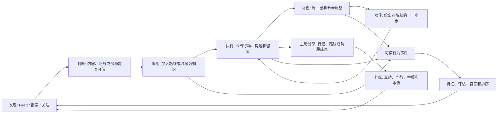

# 万卷行生产级功能闭环蓝图

## 目标与边界

万卷行的目标不是复制抖音或小红书的内容消费时长，而是让用户从一次可信发现，
走到一次可验证行动，并将结果安全地回流为下一次更合适的发现。产品的北极星
不是 `DAU x 停留时长`，而是有明确意图的用户完成一次最小行动后的持续率。



任何新功能都必须说明它在上图中位于哪个节点、写入哪个事实源、产生何种可验证
事件，以及不可用时如何安全降级。不能为方便展示复制内容、关系或行动事实。

## 已实现的闭环

当前工作区已经具备第一版的完整事实链路；它不是只有页面或产品文案。

| 用户结果 | 主事实源和入口 | 可信回流 |
| --- | --- | --- |
| 发现路线或内容 | `bbs-feed -> recommend-main`、`search-main -> bbs-search -> bbs-link`；Gateway 的 `/v1/feed`、`/v1/search` | Feed/Search 曝光以 `request_id`、内容和位置核验 |
| 将内容变成个人资源 | Gateway `/v1/posts/{id}/knowledge`；`growth.knowledge_resources` 保存内容 ID 引用而非复制正文 | `save_knowledge` 事件；收藏状态与知识资源分别可恢复 |
| 将公共路线变成私有计划 | Gateway `/v1/routes/{id}/join`；`growth` 创建/复用 Journey，`bbs` 保存参与关系 | `join_route` 事件；路线采用幂等且参与计数分片 |
| 执行与留痕 | `growth` 的 Journey、Action、Entry、精确日程、重复规则、提醒偏好与通知收件箱 | 完成来源路线或知识内容的行动时，Gateway 写入稳定的 `complete` 事件 |
| 复盘与陪伴 | `growth` 从真实行动和 Entry 派生周回望及 `CompanionBrief` | 建议只供用户确认；服务绝不自动完成、跳过或改写计划 |
| 公开分享与社区 | `bbs-link` 内容状态机、`media` 资产门禁、`comment`、`commonlikestatus`、`bbs`、`bbs-message` | 内容/评论/私信均有举报、审核或申诉边界；拉黑和静音在读路径 fail-closed |
| 改善下一次发现 | `user-event` 的幂等接收与归因校验，`feature-main`，`recommend-recall`，`recommend-rank` | `recommendation-evaluator` 与 `search-evaluator` 只使用已验证、未降级曝光 |

这条链路最重要的差异是：`complete`、`join_route` 和 `save_knowledge` 的价值高于
点赞和停留。推荐模型应优化“适合且做到”，而非把用户困在内容流内。

## 产品面补全

### 资源与知识库

`growth` 继续拥有用户私有资源、阅读进度、书签、资源到 Journey 的关联和私密
笔记。它是行动上下文的一部分，不应拆给内容服务。资源页需始终提供三种去向：

1. 稍后整理：进入 Inbox，不打扰当前路线。
2. 关联行动：加入现有 Journey 的某个阶段。
3. 开始一条路线：从资源创建可编辑的私人 Journey。

公共内容收藏后仅保存 `source_content_id`。打开时重新经过 BBS Link 的公开性和
审核检查；内容被限制后，知识库必须显示“来源当前不可用”，而不是继续展示旧
正文或媒体。资源的版权、引用与第三方来源信息属于未来目录能力，不能混入用户
的私有知识库。

### 推荐与搜索

Feed 保持两个语义清晰的面：`home` 是探索型个性化发现，`following` 是严格按
关注关系的新鲜时间流，后者不得回退为“为你推荐”。推荐必须给出有限、真实的
推荐理由，例如“你正在走这条路线”“符合你的学习兴趣”，不输出模型臆测。

搜索采用精确召回为基线、受控同义扩展为可回滚增益；索引只做候选，展示前必须
从 `bbs-link` 回读当前公开摘要。下一个版本应补产品能力，而不是另建一个搜索
服务：

- 在结果页明确区分内容、路线、创作者、主题，以及后续的公共知识条目；
- 为“现在可以开始”“适合当前阶段”“已被多少同类目标用户完成”增加可解释筛选；
- 将路线采用、资源收藏、完成行动和负反馈作为搜索质量标签，持续评估 NDCG 与净效用；
- 仅在离线评估、灰度和一键回滚齐备后加入向量召回或查询理解模型。

### 执行、复盘与陪伴

执行层以今日的最小行动为主，支持改期、跳过、暂停和恢复；“连续天数”不能作为
惩罚机制。`PUT /v1/reviews/weekly` 已会持久化用户填写的结论和下周重点，并固定
首次确认时的指标快照；再次编辑只修改用户文字，不会篡改历史回望。下一步补齐
一键确认建议调整：由 `growth` 在同一事务中记录 Review 决定和对应的
Journey/Action 变更，并保存调整前后版本，避免只生成一次性的服务端提示。

陪伴首先是可解释的规则与上下文，不是未经约束的聊天机器人：

- 早期只给一个可选、可拒绝的下一小步，说明建议来自哪些真实行动状态；
- 不代替用户设置目标、不伪造完成、不输出医疗或高风险训练处方；
- 未来如引入生成式对话，先以 `growth` 中受版本控制的 Coach Policy 编排工具调用，
  保存用户确认的行动，不保存未经同意的敏感推断；
- 只有模型供应、会话审计、提示词安全、成本隔离与人工升级通道都成为独立运维问题时，
  才拆出 Coach 服务。

### 内容与社区

内容服务现有的笔记、文章、视频和路线足以承接首发 UGC。下一批优先补两种有
行动价值的结构化内容，而非泛化更多流量型模板：

| 内容形态 | 要解决的问题 | 最小结构 | 主要动作 |
| --- | --- | --- | --- |
| 阶段成果 | 让别人判断路线是否真的适合自己 | 路线、阶段、投入、结果、调整、证据范围 | 查看路线、比较版本、采用轻量版 |
| 问题与答案 | 在执行受阻时获得可复用的帮助 | 领域、所处阶段、问题、答案状态、可选采纳结果 | 关联路线、追问、标记已解决 |

它们应扩展 `bbs-link` 的内容契约，评论继续只拥有回答正文、层级、审核和举报。
“采纳答案”“问题已解决”等与内容状态有关的事实由 BBS Link 持有，不能由评论
服务反向拥有帖子状态。所有公开互动延续拉黑/静音、审核、举报、申诉和通知
Outbox 的既有安全链路。

## 推荐与数据生产演进

参考 X 的 Candidate Pipeline 和 x-algorithm 的分层召回/排序思想，但保留本产品
的行动目标。在线链路维持如下职责，避免把每个 pipeline 阶段拆成 RPC：

```text
bbs-feed (产品 surface)
  -> recommend-main (编排、可见性、补全、多样性、曝光)
      -> recommend-recall (多源候选、游标、已看过滤)
      -> feature-main (实时特征读取与缓存)
      -> recommend-rank (版本化排序/实验桶)
      -> bbs-link / bbs / commonlikestatus (权威事实批量补全)
```

在 `recommend-main` 内部保留 Source、Hydrator、Filter、Scorer、Selector 和
Side Effect 的可测试边界。它已经足以承载新候选源和排序特征；单独部署这些阶段
会增加网络延迟与故障面，无法带来独立扩缩价值。

数据平台下一步是后台数据产品，而非同步业务 RPC：

1. 从 `user-event` Kafka Outbox 消费已验证事件，构建可回放的行为宽表与隐私删除
   投影；不得以日志抓取替代事件契约。
2. 建立内容、路线、作者和用户的离线特征快照，带特征时间、版本、血缘和 TTL。
3. 用时间切分、曝光归因和负反馈训练/评估；训练集不得把推荐曝光后的未来行为
   泄漏给特征。
4. 先以 shadow、canary 和指标门禁发布模型；出现漂移、审核风险或净效用下降时，
   回滚到当前确定性排序。

## 微服务决策

### 现在不应新增的在线服务

当前 27 个在线服务和独立 Worker 已经按内容、关系、行动、搜索、推荐、审核、
媒体和商业化分开事实所有权。以下能力应继续在现有边界中演进：

| 能力 | 应在何处实现 | 原因 |
| --- | --- | --- |
| 行动推荐、复盘确认、陪伴策略 | `growth` | 都依赖同一用户私有 Journey/Action/Entry 事务 |
| Feed 候选编排、多样性和安全过滤 | `recommend-main` | 同一请求预算内的 pipeline 阶段，不存在独立事实 |
| 向量/词法检索和索引 Worker | `bbs-search` 与其 `bg/job` | 仍是内容索引的读取投影 |
| 关注时间流与同行关系 | `bbs` + `bbs-feed` | 社交关系和 Feed 产品策略已经分离 |
| 内容格式扩展与问答状态 | `bbs-link`，正文互动在 `comment` | 内容状态和评论事实边界明确 |
| 规则型陪伴 | `growth` | 避免过早引入不可解释的 AI RPC |

### 必须先补齐的系统能力

这些是可按 Worker、Job 或基础设施接入的能力，当前不应伪装成新的业务微服务：

1. `行为聚合与离线特征`：消费 `bookway.domain-events.v1`，产出版本化特征和训练
   快照；先作为数据平台任务运行。
2. `模型训练/评测/发布`：训练编排、模型注册、离线指标、shadow/canary、漂移
   监控和一键回滚；在线调用仍通过 `recommend-rank`。
3. `内容与媒体多模态审核`：在现有 `content-audit` 和 `media-processor` 后接入图像、
   视频、OCR、版权和人工 SLA，不把审核结果复制到内容服务。
4. `身份、隐私和数据权利`：Gateway 当前验证 JWT，但生产必须接入独立的身份提供方、
   会话撤销、年龄分级、同意记录、导出/删除编排与审计。若身份成为自建事实源，
   再新增 `identity-access`；否则保持外部 IdP 集成。

### 满足触发条件后再拆分的服务

| 候选服务 | 何时拆分 | 事实边界 | 不拆分时的落点 |
| --- | --- | --- | --- |
| `knowledge-catalog` | 有合法授权的公共书、课程、机构资料，且目录审核/检索/版权更新与私人笔记的发布节奏不同 | 公共资源元数据、来源、许可、版本、引用与主题 | `growth` 只保留私人收藏和进度；`bbs-link` 只保留社区内容 |
| `notification-delivery` | 多渠道推送、邮件、短信、站内实时、偏好编排需要独立扩缩与供应商容灾 | 投递命令、渠道状态、设备令牌和发送审计；不拥有业务通知事实 | Growth 收件箱 + 现有提醒/私信/社区通知 Worker |
| `social-graph` | BBS 的关系读取成为显著 P99 瓶颈，或要支持亿级关系图遍历/共同同行推荐 | 关注、拉黑、静音、关系计数和图投影 | `bbs` 的 PostgreSQL 事实 + Redis 缓存/Outbox |
| `creator-insights` | 创作者分析、结算、归因报表与社区资料的读写模型显著分离 | 聚合分析快照，不复制内容、关系或广告账本 | `bbs-creator` 继续只持有公开经营档案 |
| `coach-main` | 生成式陪伴成为受监管、可独立发布和成本隔离的产品线 | 会话策略、模型调用审计和安全升级；行动事实仍在 Growth | `growth` 中的规则型 Coach Policy |

新增服务的前置条件是：独立事实所有权、不同的扩缩/可用性目标、独立发布节奏，
以及至少一个不能由现有服务内模块或 Worker 解决的运维问题。仅仅“代码变多”或
“参考项目里有这个服务”都不是拆分理由。

## 上线门禁和度量

功能闭环以用户结果和安全质量共同验收：

| 环节 | 首要指标 | 防止的错误优化 |
| --- | --- | --- |
| 发现 | 有效发现率：查看后收藏/采用/开始行动 | 只提高点击和停留 |
| 采用 | 内容到 Journey 转化、首次行动时间 | 只提高路线加入数 |
| 执行 | 7/28 日完成最小行动率、合理暂停后恢复率 | 强迫连续打卡 |
| 复盘 | 有回望后接受调整的比例、调整后完成率 | 只追求填写率 |
| 陪伴 | 建议展示后自愿采纳率、关闭/负反馈率 | 高频打扰和伪个性化 |
| 社区 | 有帮助互动率、举报/误伤/申诉 SLA | 只追求评论和转发 |
| 推荐/搜索 | 已验证曝光的净效用、NDCG、负反馈率、探索覆盖 | 使用无归因噪声训练 |
| 信任 | 私密数据泄漏为零、审核时效、阻断率 | 为增长放宽可见性或审核 |

每个功能发布必须同时具备：显式事件契约、幂等写入、事实源归属、失败降级、指标
看板、灰度与回滚路径。没有容量压测、故障演练和隐私/审核验证，不能把任何版本
称为抖音或小红书规模的生产级系统。
